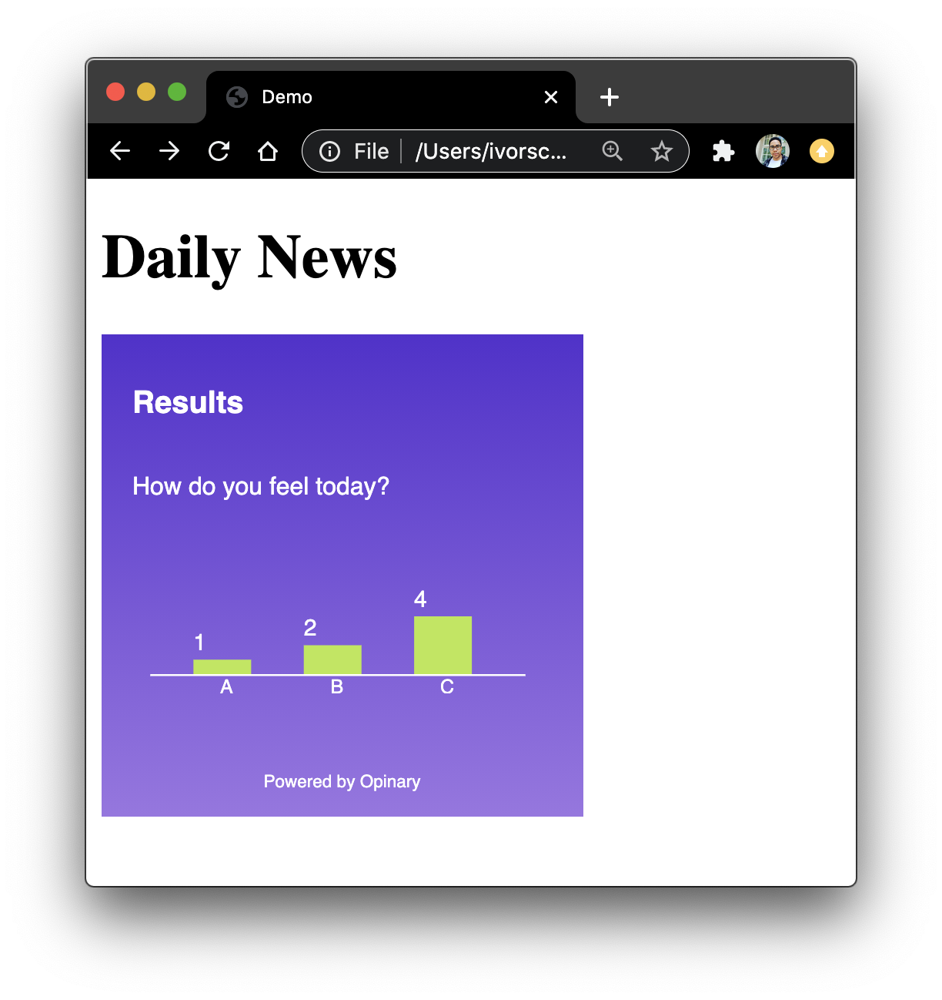

# Opinary Poll Widget

## Usage

1. Embedding in an iframe (see `/demo/index.html`)

```html
<iframe
  style="
    display: flex;
    flex: 1;
    height: 250px;
    max-width: 250px;
    border: none;
    "
  src="poll-widget.html"
></iframe>
```

2. Using the React Component see `/components/src/Poll`

```jsx
<Poll pollId="tax-spending" />
```

### How it works

Given a `pollId` the component queries a database and fetches the poll along with any results.

When the user votes, the results update, get saved and the widget presents a graph representation of the results.




## Configuration

Configure the questions in the backend. Then fetch the poll data from the backend using a pollId.

Example data structure

```json
{
  "feel-today": {
    "question": "How do you feel today?",
    "choices": {
      "A": "Brilliant! I have so much energy.",
      "B": "I've had worse days.",
      "C": "Please, end my misery."
    },
    "results": {
      "A": 1,
      "B": 2,
      "C": 3
    }
  },
  "tax-spending": {
    "question": "Where would you like your tax dollars spent?",
    "choices": {
      "A": "Education",
      "B": "Social Care",
      "C": "Health Care",
      "D": "Military"
    },
    "results": {
      "A": 10500,
      "B": 3000,
      "C": 700,
      "D": 400
    }
  }
}
```
